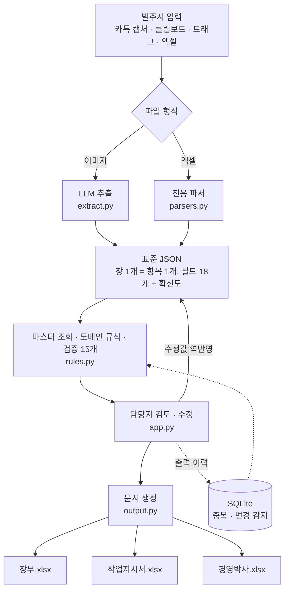
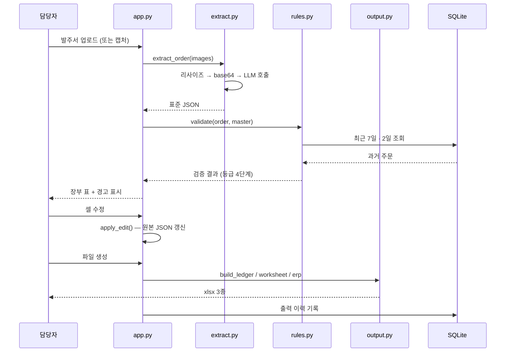

<div align="center">


# FitOrder

**비정형 발주서에서 맞춤 제작 사양을 추출해 장부 · 작업지시서 · 전표를 생성하는 자동화 시스템**

[](https://www.python.org/)
[](https://streamlit.io/)
[](https://platform.openai.com/)
[](LICENSE)

</div>

---

## 무엇을 해결하는가

블라인드 제조 공장에는 하루 400건의 발주가 들어옵니다. 거래처 9곳이 각기 다른 방식으로
보냅니다. 어떤 곳은 카카오톡으로 주문서 사진을, 어떤 곳은 채팅 메시지를, 어떤 곳은
엑셀 파일을 보냅니다. 같은 물건을 부르는 이름도 다릅니다.

담당자 한 명이 이것을 읽고 **세 개의 문서에 각각 손으로 옮겨 적습니다.**

| 문서 | 용도 |
| --- | --- |
| 장부 | 사무실 관리용. 내부 표기와 배송 정보 포함 |
| 작업지시서 | 제작 현장 전달용. 내부 표기를 제거하고 단순화 |
| 경영박사 전표 | ERP 등록용. 치수에서 면적과 금액을 계산 |

세 문서는 같은 주문을 담지만 표기 규칙이 전부 다릅니다. 그리고 그 규칙은
**어디에도 문서화되어 있지 않았습니다.**

---

## 어떻게 동작하는가



### 같은 주문이 세 문서에서 어떻게 달라지는가

```
                 카톡 캡처 1장
                       │
       ┌───────────────┼───────────────┐
       ▼               ▼               ▼
     장부           작업지시서       경영박사
  JO (K)             JO           B200(IV)-L18/원코드
  B 원코드 200       원코드 200      2.59  ·  55,167  ·  5,517
  54.5 X 116        54.5 X 116     110.0*235.0/1EA
  좌  ·  손150       좌  ·  손150    사원코드 1
  목(택배) ☆         목
```

- 장부는 내부 관리 표기 `(K)` 와 배송 기호 `☆` 를 유지하고, 셀 안에서 `원코드` 만 초록색
- 작업지시서는 내부 표기와 접두사 `B` 를 제거하고 16행 단위로 시트를 나눔
- 전표는 치수에서 면적(헤베)을 계산하고 거래처별 단가를 적용해 금액과 부가세를 산출

---

## 설계 원칙

### AI 출력을 그대로 쓰지 않는다

LLM은 확률적으로 동작하므로 금액이나 치수를 그대로 신뢰할 수 없습니다.
세 계층으로 나누어 각 계층이 잘하는 일만 맡게 했습니다.

| 계층 | 역할 | 담당 |
| --- | --- | --- |
| 1 · 추출 | 서식이 달라도 읽는다 | LLM |
| 2 · 검증 | 계산은 결정적으로, 이상치는 표시 | 코드 |
| 3 · 확정 | 표시된 것만 확인하고 책임진다 | 사람 |

품명 조합, 면적, 단가, 금액, 부가세는 전부 코드에서 계산합니다.
AI는 "무엇이 적혀 있는가"만 답합니다.

### 전수 검토를 요구하지 않는다

초기 설계는 치수를 매번 확인해야 다음으로 넘어가는 방식이었습니다.
하루 400건에 3초씩이면 20분이고, 그보다 나쁜 것은 **200번쯤 누르면 사람이 보지 않고
누른다**는 점입니다. 형식만 남고 안전장치는 사라집니다.

전수 확인을 없애고 검증 규칙 15개로 이상치만 추려냅니다.
담당자는 400건 중 표시된 것만 확인합니다.

### 기존 서식을 그대로 재현한다

글꼴, 셀 병합, 열 정렬, 셀 안 일부 단어만 색을 바꾸는 처리까지 원본과 동일하게
생성합니다. 담당자가 서식을 다시 만지지 않고 바로 인쇄할 수 있어야 실제로 쓰입니다.

---

## 코드 구성

| 파일 | 줄 수 | 역할 |
| --- | --- | --- |
| [`src/app.py`](src/app.py) | ~520 | Streamlit 화면, 상태 관리, 편집 반영, 클립보드 감시 연결 |
| [`src/extract.py`](src/extract.py) | ~180 | LLM 호출, 이미지 리사이즈, 실패 원인 자가 진단 |
| [`src/prompt.py`](src/prompt.py) | ~170 | 도메인 프롬프트 — 공통 규칙 13개 + 거래처별 양식 4종 |
| [`src/extract_schema.py`](src/extract_schema.py) | ~150 | Structured Outputs 스키마 (strict 모드) |
| [`src/parsers.py`](src/parsers.py) | ~230 | 엑셀 발주서 파서. 헤더를 읽어 열 위치를 동적 매핑 |
| [`src/rules.py`](src/rules.py) | ~370 | 마스터 조회, 금액 계산, 검증 15개, 중복 · 변경 감지 |
| [`src/output.py`](src/output.py) | ~510 | 문서 3종 생성, 서식 재현, 편집값 역파싱 |
| [`src/clipboard_watch.py`](src/clipboard_watch.py) | ~65 | 클립보드 감시 — 캡처하면 자동 추가 |
| [`src/evaluate.py`](src/evaluate.py) | ~170 | 정답셋 대조 정확도 측정 |

자세한 내용은 [`docs/ARCHITECTURE.md`](docs/ARCHITECTURE.md) 를 참고하세요.

### 데이터 흐름



---

## 도메인 규칙

문서화된 자료가 없어 실제 데이터에서 역산했습니다.
전표 4,783행과 품목 마스터 1,201건을 대조해 규칙을 확정하고,
계산 결과를 실제 전표값과 맞춰 검증했습니다.

```python
# 면적(헤베) — 소수 둘째 자리 반올림, 최소 1.5
raw  = Decimal(가로) / 100 * Decimal(세로) / 100
헤베 = raw.quantize(Decimal("0.01"), rounding=ROUND_HALF_UP)
수량 = max(헤베, Decimal("1.5"))

# 검산: 110 × 235 → 2.585 → 2.59 → × 21,300 = 55,167 → 부가세 5,517
```

`float` 은 `round(2.585, 2)` 를 `2.58` 로 계산합니다.
금액을 다루므로 전 계산을 `Decimal` 로 처리했습니다.

주요 규칙 목록은 [`docs/RULES.md`](docs/RULES.md) 에 정리했습니다.

---

## 정확도

실제 발주서 21건 · 38행 기준입니다.

| 항목 | 정확도 |
| --- | --- |
| 품목 · 색상 | **100 %** |
| 가로 | **100 %** |
| 수량 | **100 %** |
| 세로 | 97 % |
| 손잡이 길이 | 97 % |
| 손잡이 방향 | 89 % |

제작 손실로 직결되는 항목에는 오차가 없었습니다.
남은 오차는 검증 규칙이 표시하여 담당자가 확인합니다.

```bash
cd src
python evaluate.py ../data/samples          # 전체
python evaluate.py ../data/samples DU       # 거래처 하나
```

처리 성능은 엑셀 발주서 18개(주문 54건 · 424행)를 오류 없이 처리하고
문서 3종 생성까지 1초 미만입니다.

---

## 설치

### 요구사항

- Python 3.12
- OpenAI API 키
- Windows (클립보드 감시 기능 사용 시)

### 개발 환경

```bash
git clone https://github.com/<사용자명>/fitorder.git
cd fitorder

python -m venv .venv
.venv\Scripts\activate          # Windows
pip install -r requirements.txt
```

`.env.example` 을 복사해 `.env` 를 만들고 키를 넣습니다.

```
OPENAI_API_KEY=sk-proj-...
```

### 마스터 데이터

`data/master/fitorder_master.xlsx` 가 필요합니다.
실제 거래처 단가가 포함되어 저장소에는 올리지 않았습니다.
필요한 시트 구조는 [`data/master/README.md`](data/master/README.md) 에 있습니다.

### 실행

```bash
cd src
streamlit run app.py
```

Windows 에서는 `run.bat` 을 실행하면 브라우저가 앱 모드로 열립니다.

### 배포

| 방식 | 방법 | 특징 |
| --- | --- | --- |
| 포터블 | `setup_portable.bat` → `run.bat` | Python 설치 불필요, 폴더 복사로 배포 |
| 실행파일 | `release/build.bat` | PyInstaller 로 exe 생성 |

자세한 절차는 [`docs/DEPLOY.md`](docs/DEPLOY.md) 를 참고하세요.

---

## 데이터 취급

실제 거래 자료를 다루므로 다음을 지켰습니다.

- 마스터 데이터에서 대표자명 · 사업자등록번호 · 연락처 · 이메일 · 주소를 제외
- 검증용 파일은 고객명 · 현장명 · 전화번호를 가명으로 치환
- 저장소에 발주서 샘플과 마스터 데이터를 포함하지 않음

외부로 전송되는 것은 **발주서 이미지와 프롬프트뿐**입니다.
거래처별 단가, 장부 데이터, 계산 결과는 로컬에만 존재합니다.
엑셀 발주서는 파서로 직접 읽으므로 네트워크를 사용하지 않습니다.

---

## 알려진 한계

- 담당자가 임의로 줄여 쓰는 기재사항 표기는 그대로 재현하지 못합니다
  (정보가 누락되지는 않고 더 자세히 나옵니다)
- 이미지 추출에 인터넷 연결이 필요합니다
- 새 거래처를 추가할 때 양식 분석과 프롬프트 규칙 추가가 필요합니다
- 담당자 수정 이력을 학습에 반영하는 기능은 미구현입니다
- 화면에 쌓인 장부는 `파일 생성` 을 누르기 전까지 저장되지 않습니다

---

## 라이선스

[MIT](LICENSE)
