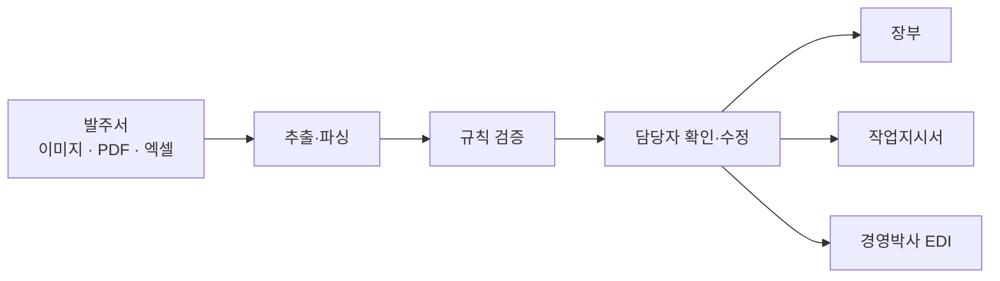
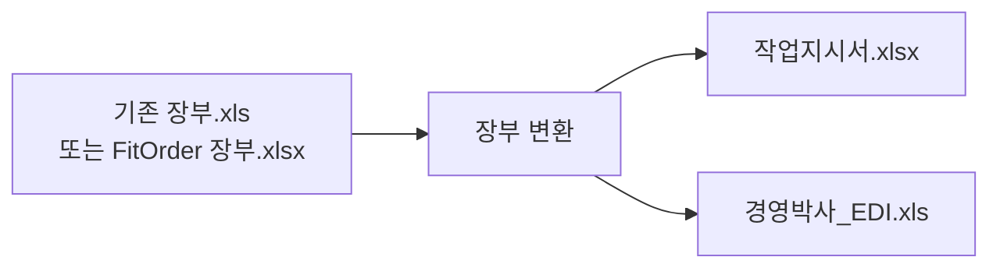

<div align="center">


# FitOrder

### 블라인드 제조 공장을 위한 발주서 자동 변환 시스템

카카오톡 이미지 · PDF · 메시지 · 엑셀 발주서를 읽어  
**장부 · 작업지시서 · 경영박사 EDI**로 변환합니다.

[](https://www.python.org/)
[](https://streamlit.io/)
[](https://platform.openai.com/)
[](LICENSE)

</div>

---

## FitOrder가 하는 일

거래처마다 다른 형식의 발주서를 담당자가 세 문서에 반복해서 옮겨 적던 업무를 자동화합니다.

| 입력 | 처리 | 출력 |
| :--- | :---: | :--- |
| 카카오톡 캡처·이미지 | AI 추출 + 코드 검증 | `장부.xlsx` |
| 다중 페이지 PDF | → | `작업지시서.xlsx` |
| 거래처별 엑셀 | 결정적 전용 파서 | `경영박사_EDI.xls` |
| 기존 공장 장부 `.xls` | 장부 역변환 | 작업지시서 + EDI |



기존에 작성한 장부를 다시 활용할 수도 있습니다.



---

## 핵심 특징

### 1. AI는 읽기만 하고 계산은 코드가 수행

AI의 응답을 바로 문서에 쓰지 않습니다.

| 단계 | 역할 | 담당 |
| :---: | :--- | :--- |
| 1 | 서식이 달라도 발주 내용을 읽음 | LLM / 엑셀 파서 |
| 2 | 품목·단가·면적·금액·부가세 계산 및 검증 | Python 코드 |
| 3 | 오류·확인·중복·변경 항목만 검토 | 담당자 |

### 2. 이상치만 확인

- 🟥 오류: 필수값 누락·규칙 위반, 파일 생성 차단
- 🟨 확인: 큰 치수·손잡이 길이 등 확인 권장
- 🟪 중복·변경: 최근 주문과 비교해 표시
- ℹ️ 예외: 부속·수리 등 장부 제외 대상

상태를 선택하면 해당 장부 행, 발생 원인, 발주서 원본을 함께 확인할 수 있습니다.

### 3. 현장에서 쓰던 문서 형태 유지

- 글꼴·셀 병합·열 너비·인쇄 구조 재현
- `원코드` 초록, `셔터` 빨강, `틀안` 파랑, `선불` 빨강
- 작업지시서는 내부 표시와 장부용 접두사를 제거
- 경영박사 EDI는 거래처별 관리코드·단가 열을 적용

### 4. 이미지부터 기존 장부까지 한 화면에서 처리

업로드 영역은 하나이며 처리 목적에 따라 버튼을 선택합니다.

- **분석 시작**: 이미지·PDF·발주 엑셀을 새 주문으로 분석
- **장부 변환**: 기존 `.xls` 또는 FitOrder `.xlsx` 장부로 작업지시서·EDI 생성

장부 변환은 AI API를 사용하지 않습니다.

---

## 지원 입력

| 형식 | 처리 방식 | 비고 |
| :--- | :--- | :--- |
| PNG / JPG / JPEG | GPT-4o Structured Outputs | 카카오톡 캡처 포함 |
| PDF | 페이지 이미지 변환 후 분석 | 최대 50페이지 |
| XLSX / XLS 발주서 | 거래처별 전용 파서 | 인터넷 연결 불필요 |
| XLSX / XLS 장부 | 장부 역파싱 | 작업지시서·EDI 출력 |
| 클립보드 이미지 | 자동 감시 또는 붙여넣기 | 서버와 브라우저가 같은 PC일 때 |

현재 코드에 등록된 거래처:

`DI` · `휴안` · `M` · `DU` · `RT` · `JO` · `JL` · `SP` · `유앤` · `아지트` · `WT` · `인천)트루` · `미래가공` · `보노` · `MS`

거래처 규칙은 [`docs/RULES.md`](docs/RULES.md)에서 확인할 수 있습니다.

---

## 문서별 변환 예시

| 장부 | 작업지시서 | 경영박사 EDI |
| :--- | :--- | :--- |
| `JO (K)` | `JO` | 거래처 관리코드 |
| ` B 원코드 200` | `원코드 200` | `B200(IV)-원코드` |
| `54.5 X 116` | `54.5 X 116` | 면적·단가·금액·부가세 |
| 내부 표시·배송 기호 유지 | 제작에 필요한 값만 유지 | EDI 지정 열에 출력 |

면적과 금액은 부동소수점 오차를 피하기 위해 `Decimal`로 계산합니다.

```python
raw = Decimal(가로) / 100 * Decimal(세로) / 100
헤베 = raw.quantize(Decimal("0.01"), rounding=ROUND_HALF_UP)
수량 = max(헤베, Decimal("1.5"))
금액 = (Decimal(단가) * 수량).quantize(Decimal("1"), rounding=ROUND_HALF_UP)
```

---

## 빠른 시작

### 준비 사항

- Windows 10/11
- Python 3.12
- 이미지·PDF 분석 시 OpenAI API 키
- `data/master/fitorder_master.xlsx` 마스터 파일

### 설치

```bash
git clone https://github.com/sieunzzz/FitOrder.git
cd FitOrder
python -m venv .venv
.venv\Scripts\activate
pip install -r requirements.txt
```

`.env.example`을 복사해 `.env`를 만든 뒤 API 키를 입력합니다.

```dotenv
OPENAI_API_KEY=본인의_API_키
```

> API 키와 실제 거래처·단가 데이터는 GitHub에 올리지 마세요.

### 실행

```bash
run.bat
```

또는 개발 모드로 실행합니다.

```bash
cd src
streamlit run app.py
```

---

## 폴더 구조

```text
FitOrder/
├─ src/
│  ├─ app.py                 # 화면·상태·장부 편집·다운로드
│  ├─ extract.py             # 이미지·PDF 분석과 오류 진단
│  ├─ prompt.py              # 공통·거래처별 추출 규칙
│  ├─ extract_schema.py      # Structured Outputs 스키마
│  ├─ parsers.py             # 거래처별 XLS/XLSX 발주서 파서
│  ├─ rules.py               # 마스터 조회·계산·검증·중복 감지
│  ├─ output.py              # 장부·작업지시서·EDI 생성·장부 역변환
│  ├─ clipboard_watch.py     # 클립보드 이미지 감시
│  └─ evaluate.py            # 정답 데이터 기반 정확도 측정
├─ data/
│  ├─ master/                # 품목·거래처·단가 마스터(비공개)
│  └─ samples/               # 평가용 발주서·정답(비공개)
├─ db/                       # 출력 이력 SQLite(자동 생성)
├─ out/                      # 생성 문서·업로드 임시파일(자동 생성)
├─ assets/                   # GitHub 문서용 로고
├─ docs/                     # 구조·규칙·배포 문서
├─ release/                  # PyInstaller 실행파일 빌드 설정
├─ requirements.txt
├─ run.bat
└─ .env                      # API 키(커밋 금지)
```

---

## 주요 코드

| 파일 | 역할 |
| :--- | :--- |
| [`src/app.py`](src/app.py) | 업로드, 검토표, 상태 상세, 행 삭제, 장부 변환 |
| [`src/extract.py`](src/extract.py) | 이미지 리사이즈, PDF 페이지 처리, LLM 호출 |
| [`src/parsers.py`](src/parsers.py) | 엑셀 발주서의 헤더·값 기반 동적 파싱 |
| [`src/rules.py`](src/rules.py) | 품목 조회, `Decimal` 계산, 검증, 중복·변경 탐지 |
| [`src/output.py`](src/output.py) | 문서 생성, 서식 재현, XLS/XLSX 장부 역파싱 |

전체 데이터 흐름은 [`docs/ARCHITECTURE.md`](docs/ARCHITECTURE.md), 배포 방법은 [`docs/DEPLOY.md`](docs/DEPLOY.md)를 참고하세요.

---

## 정확도와 평가

실제 발주서 21건·38행 기준:

| 항목 | 정확도 |
| :--- | ---: |
| 품목·색상 | **100%** |
| 가로 | **100%** |
| 수량 | **100%** |
| 세로 | 97% |
| 손잡이 길이 | 97% |
| 손잡이 방향 | 89% |

```bash
cd src
python evaluate.py ../data/samples
python evaluate.py ../data/samples DU
```

프롬프트 변경 후 정확도를 다시 측정할 때는 `data/samples/_cache`를 비우고 실행합니다.

---

## 데이터와 보안

- 외부 API로 전송되는 정보: 발주서 이미지와 추출 프롬프트
- 로컬에만 저장되는 정보: 품목 마스터, 단가, 계산 결과, 장부, 출력 이력
- `.env`, `data/master`, `data/samples`, `db`, `out`은 `.gitignore`에서 제외
- `out/_clip`, `out/_upload`에는 실제 발주서가 남을 수 있으므로 배포 전에 정리

---

## 문서

- [시스템 구조](docs/ARCHITECTURE.md)
- [도메인 규칙](docs/RULES.md)
- [배포 안내](docs/DEPLOY.md)
- [기여 방법](docs/CONTRIBUTING.md)

---

<div align="center">

반복 입력은 줄이고, 제작에 필요한 확인에 집중합니다.

</div>
