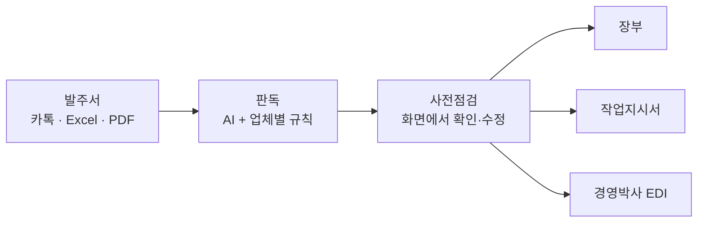

# FitOrder

### 블라인드 제조 공장을 위한 발주 자동화 프로그램

카카오톡 이미지·메시지, Excel, PDF로 들어오는 제각각의 발주서를 읽어 
**사전점검 → 장부 · 작업지시서 · 경영박사 EDI**까지 한 번에 만듭니다.

---

| 제품군 | 블라인드 · 롤/콤비 · 홀딩도어 |
|---|---|
| 화면 | PySide6 데스크톱 (Windows) |
| 버전 | `2026.09.13-109` |

## 이렇게 동작합니다
- **판독은 AI, 계산은 규칙** — 금액·수량·최소과금·포장비·배송 판정은 AI에 맡기지 않고 규칙으로 계산합니다.
- **업체별 규칙** — 거래처마다 다른 기재사항·부속·배송 표기를 그대로 지킵니다. 확정 규칙은 [`docs/RULES_MASTER.md`](docs/RULES_MASTER.md), [`docs/RULES_HOLDING.md`](docs/RULES_HOLDING.md)에 있습니다.
- **사람이 고친 값이 최우선** — 사전점검에서 수정·병합한 내용은 세 결과물에 똑같이 반영되고, 자동값으로 되돌아가지 않습니다.
- **기존 장부도 불러오기** — 직접 쓴 장부(.xls/.xlsx)를 사전점검으로 불러와 작업지시서·전산 파일을 만들 수 있습니다.

## 시작하기 (Windows)
1. `00_INSTALL_FIRST.bat` 실행 — Python과 필요한 패키지를 설치합니다.
2. `support/env.example`을 프로젝트 폴더에 `.env`로 복사하고 `OPENAI_API_KEY`를 입력합니다.
3. `01_RUN_FITORDER.bat` 실행 — 프로그램이 열립니다.

> `.env`(API 키)와 `out/`(실제 주문 출력)은 저장소에 올리지 않습니다.

## 폴더 구조 (src/)
- `qt_app.py` : PySide6 화면. 시작화면(블라인드/롤·콤비/홀딩도어) → 제품군별 `OrderWorkspace`
  (왼쪽 입력 · 오른쪽 사전점검 표 · 병합/해제 · 행 추가/이동/삭제 · 셀 복사/붙여넣기 · 파일 생성)
- `desktop_workflow.py` : 입력 → 표준 주문 → 사전점검 행 → 셀 수정 반영 → 출력 연결, 행 고유 ID, 수동 병합 → 엑셀 반영
- `output.py` : 주문→장부행(`to_rows`), 장부/작업지시서 xlsx, 경영박사 EDI xls, 기존 장부 역변환(`read_ledger`),
  장부 병합 계산(`ledger_merge_ranges` — 사전점검 화면도 이 결과를 그대로 사용)
- `rules.py` : 거래처 정보, 블라인드 마스터, 금액 계산, DI 믹스, 검증
- `holding.py` / `roll_combo.py` : 홀딩도어 / 롤·콤비 규칙과 품목장
- `parsers.py`, `extract.py`, `extract_schema.py`, `prompt.py` : Excel 파서 / AI 판독
- `master_loader.py`, `master_registry.py` : 품목장 로딩 (`data/master/`)

## 2026-09-13 변경 (v109)
1. **장부 → 사전점검**: 직접 작성한 장부.xls/xlsx를 사전점검으로 불러와 확인·수정 후 [파일 생성]으로 장부·작업지시서·EDI 생성 (블라인드·홀딩)
2. **사전점검을 엑셀처럼**
   - 화면 자동 병합 = 장부 엑셀 자동 병합 (같은 계산 `ledger_merge_ranges` 사용)
   - 병합된 셀을 수정/삭제하면 병합된 모든 행에 반영
   - 수동 병합·해제를 행 고유 ID로 기억 → 행 추가/이동/삭제 후에도 유지, 병합 안에 행을 넣으면 범위 확장
   - 기존 병합과 겹치게 선택해도 병합됨, Ctrl+C / Ctrl+V 셀 복사·붙여넣기
3. **출고일**: 달력에서 날짜로 선택, 장부·작업지시서·사전점검에는 요일로 표시 (롤·콤비의 `9/15` 표시 → `화`)
4. **비닐 포장 문구 전면 제거**: 비닐포장·겉비닐·걷비닐·창별 비닐포장·비닐 겉면 기재 등은 발주서·사전점검 직접 입력 어디에서 들어와도 장부·작업지시서·사전점검·EDI에 적지 않음(`rules.strip_vinyl_text`)
5. **미더스(M)는 블라인드 거래처에서 제외** (홀딩도어 미더스 (K)는 유지, `desktop_workflow.BLIND_CLIENTS`)
6. 기존 오류 수정: 사전점검 거래처 변경 창 오류(`CLIENT_INFO` 미정의), 홀딩 "레일연결부속" 줄이 본품+부속으로 중복되고 부속 개수가 1로 바뀌던 문제
7. **자기 배송(기본 배송지가 발주 업체 본인 + 배송 정보 없음)**: 장부·EDI에 택배/화물 없음, 포장비용은 적음 (`tests/test_delivery_self.py`로 고정)
8. **대일 외 블라인드 MIX** (정답 장부 `JL 믹스.xls` + 4색 배합 예시, 대일은 기존 형식 유지)
   - 판별: "믹스/mix/MIX" + `200+125` 조합. 원코드/투코드 표시가 없으면 투코드
   - 길이: 비율(%)이면 세로 비례, 길이면 그대로, 없으면 똑같이 나눔. 0.5 단위 반올림
   - 장부: 품목 `B Mix 200+125`, 같은 규격 창을 모두 적은 뒤 구성행(규격 D:F=코드 굵은 테두리, G:H=`) 108cm`)을 한 번만. 4가지 이상은 `B 원코드 Mix` + 첫 구성행 C열에 조합. 기재사항·출고일·작업지시서 업체명 병합은 구성행까지
   - 실 색(실:W)은 자동으로 적지 않음. 사전점검 상태 **MIX확인**(노랑), 조합을 못 찾으면 **MIX조합확인**
   - 사전점검 구성행: 코드(가로 칸)·길이(수량 칸) 수정 가능 → 같은 MIX 묶음 전체에 반영
   - EDI: `B-MIX-투코드/25mm`, `B-MIX-L18/원코드/25mm` 등, 적요 맨 앞 `200(108)+125(12)`, `B추가비용-MIX`(L자 `/Ltype`) 창당 1개 0원
   - 장부 → 사전점검 불러오기에서 구성행 길이도 읽음
9. **업체별 1차 수정** (`tests/test_vendor_round1.py`)
   - 전체
     - `심플`은 `셔터`로 인식한다.
     - 표 형식 발주서는 JO의 좌/우·수량·비고 읽기 규칙을 모든 표 양식에 적용한다(AI 판독 안내문).
     - 같은 기재사항은 위아래로 병합한다. 기재사항2가 비면 1·2를 직사각형으로 병합하고, JL/JO의 기재사항2도 세로 병합한다.
     - 기재사항1·2가 같으면 좌우로 합친다.
     - 사전점검 마지막 행에 **총 창수**를 표시한다(블라인드·홀딩·롤콤비).
     - 연창 창은 경영박사 적요 맨 앞에 `#`를 붙인다.
     - 택배/화물 경영박사 행은 수량 1이다(`**` 줄은 0).
     - 경영박사 발신 품목코드·품명은 `└ 발 신:`이다.
     - 선불은 장부의 이름·전화번호 행 기재사항2 칸에 적는다.
     - 장부 역변환은 세로 병합된 I~L열(길이·특이·기재사항1/2)을 아래 행에도 같은 값으로 읽는다.
   - 대일: 작업지시서도 주문이 없는 유형 시트는 만들지 않는다.
   - 휴안
     - `기타` 칸(헤더 이름)에서 추가부속·손길이·요구사항을 읽는다.
     - 노피스는 장부 별도 행(색상 `노피스(3)`, 수량 `2EA`)으로 적는다.
     - 석고앙카는 세로가 가장 긴 창에만 적고, 경영박사에는 `앙카3`으로 적는다.
   - 보노/미래가공(블라인드 + 롤콤비 안산)보노)
     - 작동방식필증을 특이에 적는다.
     - 장부 화물 주소의 전화번호 앞에 `/`를 쓰지 않는다.
     - 경영박사 적요 순서: 손 → 지점(박달) → 방 → 오더명.
     - 경영박사 화물 행은 `지점 - 받는사람`, 다음 `**` 줄에 전화번호를 적는다.
     - 롤콤비도 창당 포장비용을 붙이고, `1EA` 다음은 한 칸 띄운다.
   - JL: 같은 색상 칸에 여러 코드가 있으면 MIX로 처리한다.
   - 루임트
     - 주소·수령인은 `더커튼`, 기재사항은 `더`로 적는다.
     - 도로명 주소 없이 화물지점만 있어도 장부 주소행(`오산삼미 - 더커튼 / 전화`)을 만든다.

10. **장부 → 경영박사 연결 점검·수정** (`tests/test_ledger_to_edi.py`: 발주서→EDI와 장부→불러오기→EDI 결과 비교)
    - 휴안 노피스 경영박사 품목: `노피스(3)`/`2EA` → `노피스브라켓(3EA)` 수량 2 (기존 등록 품목명 규칙, 단가 없으면 0원)
    - 배송 방식을 거래처 기본값이 아니라 장부 모양/출고일 `(택배)(화물)` 표시로 복원한다(화물이 택배로, 보노 택배가 화물로 바뀌거나 SP·MS 배송행이 사라지던 문제)
    - 받는사람 행이 고객명을 덮어쓰지 않는다. 이름만 있는 기재사항은 JO 주문번호/보노 오더명으로 쓰지 않는다
    - JL/DU/홀딩: 모든 창에 공통인 기재사항만 고객명·공통기재로, 창마다 다른 값은 창별 메모로 복원한다. 홀딩 창별 메모의 방 이름은 설치장소로 되돌린다
    - SP: 상호 칸 주문번호 끝 숫자(7)를 기재사항의 전체 주문번호(C-7)로, 첫 행의 공지를 주문 공통으로 복원한다
    - 부속행(석고앙카2, 휴안 노피스, 유앤 노피스브라켓)과 `B MIX 029FP`의 MIX 표시를 복원한다. 포장비용은 제품 적요에 넣지 않는다
    - 세로 병합된 I~L열(길이·특이·기재사항1/2)을 아래 행에도 같은 값으로 읽는다. 장부 길이 칸은 같은 값끼리만 병합한다(기본 길이 창까지 위 길이로 병합되던 오류)
    - FitOrder가 만든 DI 장부(C 원코드 등 유형별 시트)를 다시 읽는다

## 2026-09-14 변경 — 업체별 2차 수정 (`tests/test_vendor_round2.py`)
- 전체
  - 노피스 수량 `3EA` → `3set`
  - 피스가 있으면 장부·경영박사 `피스/이름` 순서 (받는사람을 기재사항1 맨 앞에 넣던 공통 처리가 피스 뒤로 넣음)
  - 석고: `석고`만 → 석고앙카, `석고칼블럭-날개` → 석고날개
  - 장부 `"` 왼쪽+아래쪽 맞춤
  - 경영박사 추가부속 적요 `수량/이름`, 포장비용 적요 `이름` (`output._erp_order_name`)
  - 경영박사 택배 주소: 번지 뒤 쉼표 없이 상세주소 새 줄 (`output._erp_address_lines`, 장부는 쉼표 유지)
  - 작업지시서에서 주소·이름/전화번호·발신·포장비용 행 제외 (`output._worksheet_excluded`)
  - 롤스크린 손잡이길이 5단위 내림 (`rules.normalize_roll_handle`)
- 휴안: 가장 긴 창의 부속을 이름 앞에 (`석고앙카3/박시은`) — 공통 처리가 이름을 맨 앞으로 옮기던 문제
- 유앤: 피스 종류를 가로별 피스 수 합계 `10EA`로 장부·경영박사에 출력(이전에는 경영박사에 부속행이 아예 없었음), 장부 역변환도 새 형식을 읽음

## 2026-09-18 변경
- 기본 길이가 아닌 손잡이길이를 전 업체 경영박사 적요에 `손120`으로 넣는다 (`output._erp_ledger_handle`).
  전에는 DI·JL·보노만 나오고 다른 업체는 사전점검 길이 칸에만 보였다. 기재사항에 `줄140`으로 적혀 있던 창은
  적요 뒤쪽이 아니라 규격 바로 뒤에 `손140`으로 나온다 (`tests/test_handle_length_edi.py`)

## 2026-09-16 변경
- MIX 비율 표기 `상 102<7> : 하 870<3>` 인식 (`rules.MIX_COMBO_RX`/`parse_mix_parts`). 전에는 이 표기를 못 읽어 세로를 반씩 나눴다. 비고에만 있고 `믹스` 글자가 없어도 MIX로 처리(`rules.MIX_LAYOUT_RX`), 모델이 색을 하나만 읽어도 행 원문에서 두 색을 복구한다
- `L자형` 표기가 C자로 되돌려지던 문제 수정 (`extract.has_explicit_l_type`)
- JL 담당자 이름(`김현경`)은 기재사항·경영박사 적요에 적지 않는다 (`rules.CLIENT_STAFF_NAMES`에 거래처별 담당자 이름을 추가하면 다른 업체도 같은 규칙 적용)

## 2026-09-14 코드 정리 (동작 변경 없음)
- 삭제: `src/app.py`(Streamlit, `archive/`에 보관), `src/fitorder/ai_extract.py`, `src/blind_extra.py`, streamlit 설치 항목
- 호출되지 않던 함수/상수 삭제: qt_app `HoldingPage`, extract의 rules 중복 함수(`default_handle_length`/`normalize_handle`/`color_text`), holding `is_holding_feature_item`, roll_combo `get_roll_master`, master_registry `clear_master_cache`, parsers `_freight_info`, output `_al`/`_border`/`INNER`/`ERP_HEAD`, rules `EXCEPTION_WORDS`/`COLOR_FONT`/`NOTE_FONT`/`similar`
- 정리 전 백업: `FitOrder_backup_v109_before_cleanup_2026-09-14.zip`

## 알려진 한계 (미수정)
- 유앤 피스 품목(`피스(석고앙카)` 등)은 로컬 품목장에 없어 경영박사 규격 칸이 비어 있다(경영박사가 관리코드로 채우는지 확인 필요)
- DI·JL·보노/미래가공은 발주서에 기본 길이(예: 손130)가 적혀 있으면 적요에 적지만, 장부에는 기본 길이를 적지 않으므로 장부 → 경영박사에서는 그 표기가 나오지 않는다(그 외 업체는 양쪽 모두 기본 길이를 적지 않아 결과가 같다)
- DI 장부는 유형별 시트로 나뉘고 특이(연창 #) 칸이 없어, 장부 → 경영박사에서 주문 묶음·연창·배송/포장 귀속이 원래와 다를 수 있다(제품·수량·단가는 같음). 사전점검에서 확인 필요
- DI는 파일 생성 때 행을 정렬하므로, 정렬 후 떨어진 행에 걸친 수동 병합은 엑셀에 반영되지 않고 안내만 표시된다
- 품목장 `B-MIX-L18/셔터/25mm`는 2026-09-13 추가, 단가 칸은 비워 둠(사람이 직접 입력 전까지 EDI 단가 0). 경영박사 관리코드는 `B-MIX-L18/원코드/25mm`

## 테스트
`python -m pytest`
- `tests/test_characterization.py` + `tests/golden/characterization.json` : 현재 동작 고정
  (블라인드·홀딩·롤콤비 전 업체: 사전점검 표시/상태, 장부·작업지시서 셀값/색상/병합, 실제 품목장 EDI, 셀 수정, 장부 역변환, 병합 화면 시나리오)
- `tests/test_precheck_behaviors.py` : 이번 변경의 목표 동작
- 동작을 **의도적으로** 바꾼 경우에만 `python tests/_generate_golden.py <항목>`으로 갱신하고 차이를 보고한다

## 문서
- `CLAUDE.md` : 작업 지침
- `docs/RULES_MASTER.md`, `docs/RULES_HOLDING.md` : 확정 업무 규칙
- `docs/RECOVERY_STATUS.md` : 복구 경과
- `ARCHITECTURE.txt` : v100 제품군/품목장 구조 설명(원본 동봉 문서)

## 주의
실제 고객 개인정보, `.env` API 키, 실제 주문 출력·캡처 이미지는 프로젝트에 넣지 않는다.
