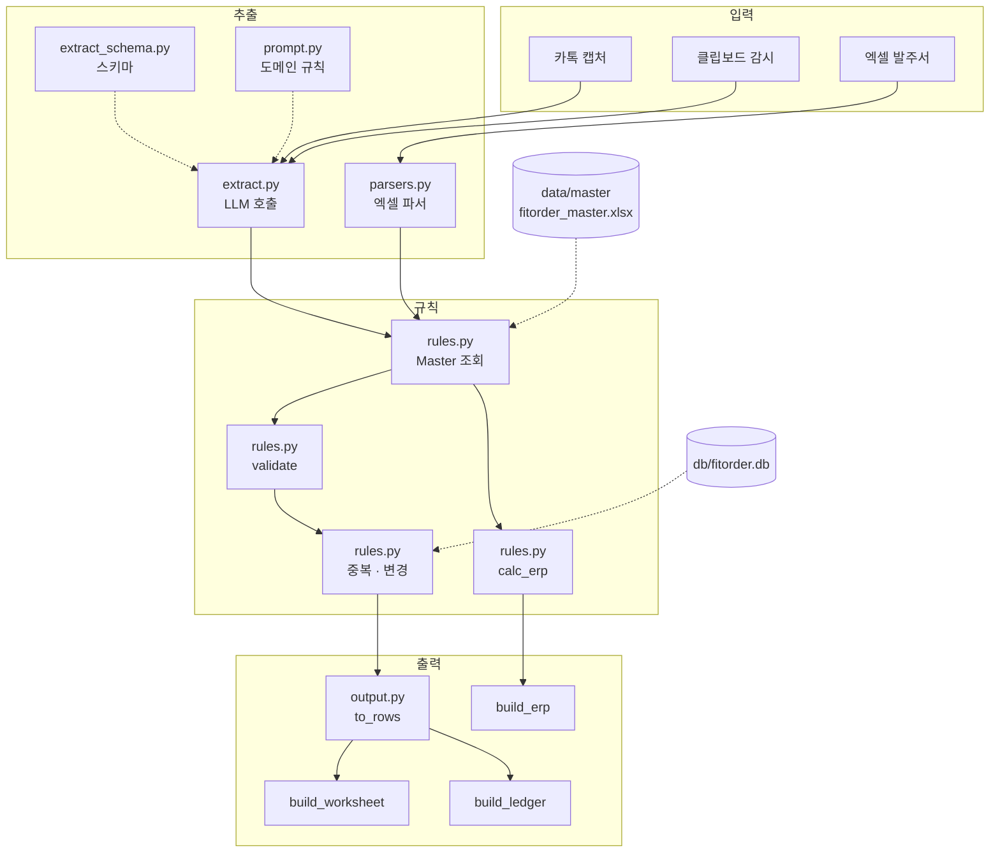
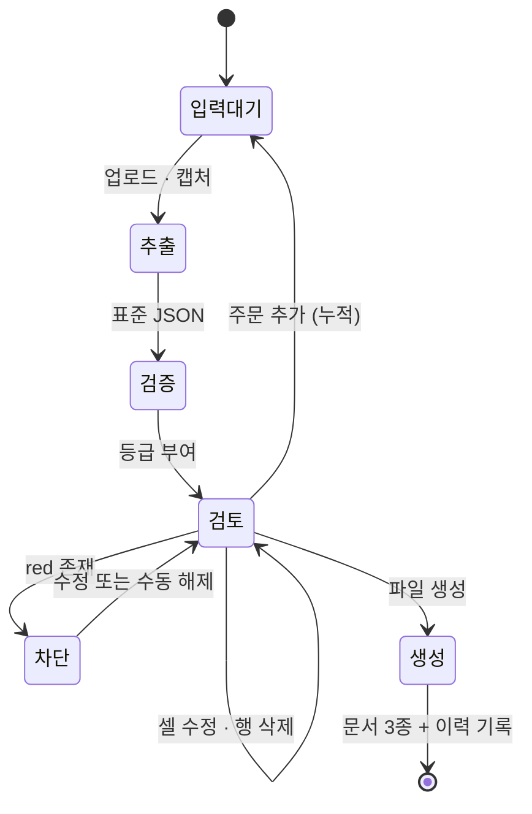

# 아키텍처

## 목차

- [전체 구조](#전체-구조)
- [모듈별 역할](#모듈별-역할)
- [데이터 모델](#데이터-모델)
- [처리 단계](#처리-단계)
- [상태 관리](#상태-관리)
- [설계 결정](#설계-결정)

---

## 전체 구조



---

## 모듈별 역할

### `app.py` — 화면과 상태

Streamlit 단일 페이지입니다. 좌측 30% 가 입력, 우측 70% 가 장부입니다.

주요 함수

| 함수 | 역할 |
| --- | --- |
| `ingest(path, hint, label)` | 파일 하나를 주문 목록에 추가. 확장자로 이미지/엑셀 분기 |
| `rebuild_rows(orders, ship, M)` | 주문 목록 → 장부 행. 행마다 원본 위치(`_oi`, `_ii`) 를 함께 저장 |
| `past_items(days)` | SQLite 에서 최근 N일 주문을 꺼내 중복 · 변경 감지에 전달 |
| `issue_panel(level, label)` | 등급별 경고 목록과 수동 해제 폼 |

편집 반영은 `st.data_editor` 의 변경분을 감지해 `output.apply_edit()` 으로
원본 JSON 을 갱신하는 방식입니다. 화면에서 고친 값이 세 문서에 모두 반영됩니다.

### `extract.py` — LLM 호출

```python
extract_order(image_paths, client_hint=None, ship_date=None) -> dict
```

- 이미지를 긴 변 1,600 ~ 2,000 px 로 맞춘 뒤 base64 PNG 로 인코딩합니다.
  **작은 캡처는 확대합니다** — 타일 수가 늘어 촘촘한 표의 판독이 좋아집니다.
- 여러 장을 한 번의 호출에 함께 넣습니다. 스크롤로 나뉜 캡처와 첨부 사진을
  같은 문맥에서 읽게 하기 위함입니다.
- `diagnose()` 가 실패 원인을 한국어로 돌려줍니다.
  키 없음 · 키 오류 · 잔액 부족 · 방화벽 차단 · 연결 없음을 구분합니다.
- 타임아웃 90초. 방화벽이 연결을 끊지 않고 붙잡는 상황에서 무한 대기를 막습니다.

### `prompt.py` — 도메인 프롬프트

14개 섹션으로 구성됩니다.

```
1  최우선 규칙          행 개수 일치, 추측 금지, 숫자 보정 금지
2  추출하지 않을 것      수신처, 거래처 상호, 매출처 열
3  품목                 코드 추출, 타입(C자/L자), 종류(원/투/셔터)
4  치수                 소수점 유지, 반올림 금지
5  손잡이               방향, 길이, 거래처별 '봉' 해석 차이
6  연창
7  수량                 특수 표기만, 창 개수와 구분
8  기재사항             행별 / 주문 공통 구분, 순서 규칙
9  표 아래 지시문        전체 적용 / 조건부 적용
10 배송
11 예외품목
12 확신도
12-1 변경 요청 판별
13 카카오톡 캡처
14 거래처별 양식        JL · M · JO · RT
```

거래처마다 표 구조가 달라 섹션 14 가 가장 중요합니다.
예를 들어 JO 는 수량 열이 창 개수를 뜻하므로 그 값을 `창개수` 필드로 받고,
행 복제는 코드에서 처리합니다. 모델에게 산수를 시키지 않습니다.

### `parsers.py` — 엑셀 파서

DI · 휴안은 엑셀로 발주하므로 LLM 을 거치지 않습니다.
정확도 100 %, 비용 0, 오프라인 동작이 이유입니다.

```python
parse_excel(path, client) -> list[dict]     # extract_order 와 동일 형태
```

**헤더를 읽어 열 위치를 찾습니다.** 파일마다 열 구성이 다르기 때문입니다.

| 파일 | 6번 열 헤더 | 실제 값 |
| --- | --- | --- |
| DI_01, DI_04 | `원/투` | 원, 투 |
| DI_02 | `커버/점보` | **원** |
| DI_03, DI_05 | `커버/점보` | 비어 있음 |

헤더 이름만 믿으면 DI_02 의 97건이 전부 부속으로 잘못 분류됩니다.
그래서 **값을 보고** 판단합니다 — `원`·`투`·`셔터` 면 종류, 그 외 문구면 부속.

### `rules.py` — 마스터 · 계산 · 검증

```python
class Master:
    find_item(code, kind, type_, client)    # 품명 조합 → 마스터 조회 → 단가
    build_name(code, kind, type_, client)   # B200(IV)-L18/원코드
    thread_color(code)                      # 손잡이실 색상 (DI 정렬용)

calc_erp(width, height, unit_price)         # 헤베 → 금액 → 부가세
validate(order, master)                     # [(등급, 코드, 메시지, 행)]
find_duplicates(orders, past)               # 중복 · 중복 의심 · 과거 중복
find_changes(orders, past)                  # 변경 후보, 출력 여부로 등급 분기
```

**검증 등급 4단계**

| 등급 | 의미 | 다운로드 |
| --- | --- | --- |
| `red` | 필수값 누락, 규칙 위반 | 차단 |
| `review` | 중복 · 변경 의심 | 통과 (표시만) |
| `yellow` | 확인 권장 | 통과 |
| `info` | 예외품목 (장부 제외) | 별도 알림 |

이미 출력한 주문의 변경은 `review` 가 아니라 `red` 로 올립니다.
종이가 현장에 나가 있을 수 있으므로 사람이 판단해야 합니다.

### `output.py` — 문서 생성

```python
to_rows(order, ship_label, M=None)          # 주문 → 장부 행
build_ledger(rows, path, header_date)       # 장부.xlsx
build_worksheet(rows, path, header_date)    # 작업지시서.xlsx
build_erp(orders, M, path, order_date)      # 경영박사.xlsx
apply_edit(order, item_idx, field, value)   # 편집값 역반영
```

서식 재현이 이 모듈의 핵심입니다.

- **부분 색상** — `CellRichText` 로 셀 안 일부 단어만 색을 넣습니다.
  `원코드` 초록, `셔터` 빨강, `틀안` 파랑, `선불` 빨강.
  모든 조각을 `TextBlock` 으로 만들어야 나머지가 기본 글꼴로 떨어지지 않습니다.
- **테두리** — 규격(D·E·F), 모형(H·I), 기재사항(J·K) 그룹 안쪽에는 세로선이 없습니다.
- **병합** — 색상이 이어지는 구간에서 같은 값이 반복되면 세로 병합.
  창이 1개면 기재사항을 J:K 가로 병합.
- **`"` 표기** — 색상이 같고 세로가 같을 때만. 휴안은 사용하지 않습니다.
- **작업지시서** — 내부표기와 접두사 `B` 제거, 16행 단위 분할,
  업체 묶음은 자르지 않음, 확인용 블록 복사.

### `clipboard_watch.py` — 클립보드 감시

```python
grab()                  # (PIL.Image, md5 해시) 또는 (None, None)
save(img, out, tag)     # 파일로 저장
too_small(img, 200)     # 아이콘 오인 방지
```

`st.fragment(run_every=2)` 로 2초마다 확인합니다.
프래그먼트로 감싸는 것이 중요합니다 — 전체 페이지가 갱신되면
담당자가 편집 중인 값이 날아갑니다.

중복 방지가 세 겹입니다.

1. 해시 집합(`clip_seen`) — 같은 이미지를 다시 처리하지 않음
2. 직전 해시(`clip_last`) — 프래그먼트가 여러 번 도는 동안의 중복 방지
3. 토글을 켠 시점의 클립보드를 미리 등록 — 껐다 켤 때 재분석 방지

---

## 데이터 모델

### 추출 스키마

`items` 배열의 항목 하나가 창 하나입니다. 필드 18개.

```
품목코드  색상원문  타입  종류  가로  세로  수량
손잡이방향  손잡이길이  연창  설치장소  기재사항  예외품목
창개수  좌개수  우개수  원문  확신도
```

최상위에 `거래처` `발주일` `고객명` `items` `배송` `전체원문`
`전체기재사항` `변경요청` `변경문구` 가 있습니다.

`확신도` 를 함께 받아 낮은 값을 자동으로 확인 대상으로 표시합니다.

### 마스터 (7시트)

| 시트 | 내용 |
| --- | --- |
| 거래처 | 9곳 · 관리코드 · 단가등급 · 배송방식 · 내부표시 |
| 품목 | 1,201건 · 품명 · 규격 · 등급별 단가 · 손잡이실 색상 |
| 손잡이실색상 | 21종 · 슬랫 번호 매핑 |
| 예외품목 | 장부 제외 대상 5종 |
| 계산규칙 | 헤베 · 금액 · 부가세 · 품명 조합 |
| 손잡이길이 | 종류 × 세로 조건별 기본값 |
| 최소사이즈 | 종류별 최소 가로 |

### 이력 DB

```sql
CREATE TABLE batch(
    id         INTEGER PRIMARY KEY AUTOINCREMENT,
    ship_date  TEXT,      -- 출고일
    created    TEXT,      -- 생성 시각
    payload    TEXT,      -- 주문 전체 (JSON)
    printed    TEXT,      -- 파일 출력 시각
    print_seq  INTEGER    -- 출력 횟수
);
```

`printed` 가 있으면 "이미 출력됨" 으로 판정해 변경 감지에서 등급을 올립니다.

---

## 처리 단계



`red` 가 하나라도 남아 있으면 파일 생성 버튼이 비활성화됩니다.
사유(신규 품목 · 특수 주문 · 거래처 확인함 · 기타)를 선택해 수동 해제할 수 있습니다.

---

## 상태 관리

Streamlit 세션 상태로 관리합니다.

| 키 | 내용 |
| --- | --- |
| `orders` | 확정 대기 중인 주문 목록 |
| `ship` | 선택한 출고일 |
| `batch_id` | 현재 배치의 DB id |
| `dismissed` | 수동 해제한 경고 키 집합 |
| `seen` | 처리한 업로드 파일 (파일명, 크기) |
| `upl` | 업로더 초기화용 카운터 |
| `watch` | 자동 캡처 감시 on/off |
| `clip_seen` / `clip_last` | 클립보드 중복 방지 |
| `net_msg` / `net_at` | 연결 진단 결과와 시각 |

파일을 생성하면 `orders` 를 비우고 다운로드 버튼만 남깁니다.
출력한 주문이 화면에 남아 있으면 담당자가 혼란스럽다는 피드백을 반영한 것입니다.

---

## 설계 결정

### 왜 Streamlit 인가

편집 가능한 표(`st.data_editor`)가 기본 제공됩니다.
이 프로젝트의 핵심 화면이 "장부를 보면서 직접 고치는 표" 인데,
직접 구현하면 며칠이 걸립니다. UI 구현 시간을 줄여
추출 정확도와 서식 재현에 집중했습니다.

### 왜 로컬 실행인가

- 클립보드 접근이 필요 — 서버와 클라이언트가 같은 PC 여야 합니다
- 거래 데이터가 외부로 나가지 않습니다
- 배포가 단순합니다 (폴더 복사 또는 exe)

### 왜 모델을 나누는가

단순한 텍스트 발주서는 저비용 모델로 충분하지만,
복잡한 표는 상위 모델이 필요합니다. 실측 결과 표 형식 발주서에서
저비용 모델은 12행 중 7행만 읽었고 상위 모델은 12행을 정확히 읽었습니다.
양식에 따라 자동 선택해 비용과 정확도를 함께 확보합니다.

### 왜 엑셀은 파서인가

DI · 휴안의 엑셀 양식은 고정되어 있습니다.
정형 데이터를 LLM 에 넣으면 오히려 틀릴 여지만 생깁니다.
파서는 정확도 100 %, 비용 0, 오프라인 동작입니다.
